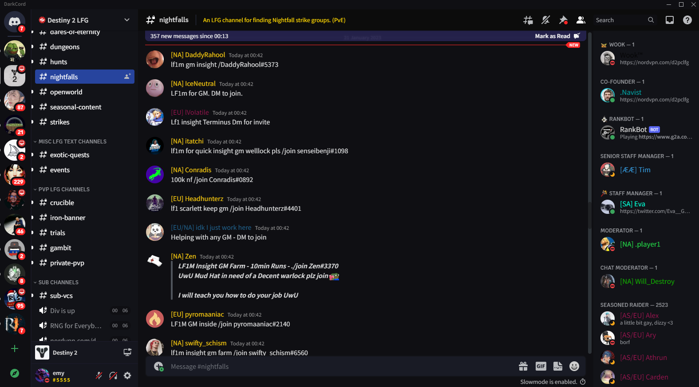
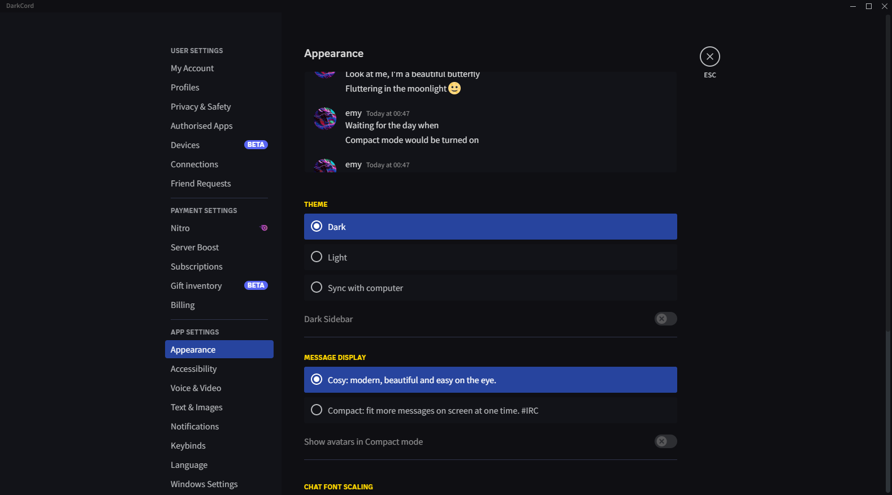

<h1 align="center">DarkCord</h1>

# About

DarkCord is a dark Discord theme which overrides many of the default color schemes of the default dark theme, making it darker and more colorful, while also keeping much of the simplistic look of the default theme. The theme does not use custom icons, animations or anything else that may potentially slow down the client, all it does is change the styling of elements.

To be clear: This is meant to be used with the __dark mode__ of Discord. It *does not* work with the light mode.

# Installation

1. Download [DarkCord.theme.css](https://sixem.github.io/DarkCord/theme/DarkCord.theme.css)
2. Place the file in your themes folder (usually it's `%AppData%/Roaming/BetterDiscord/themes/`)
3. Find `Themes` under the BetterDiscord settings and enable the theme

# Issues
Discord has a lot of elements, plugins and so on, so if you discover unstyled parts of the theme that you think should be styled, then feel free to create an issue, and I'll try to look into it.

# Previews

## Chat

## Settings

